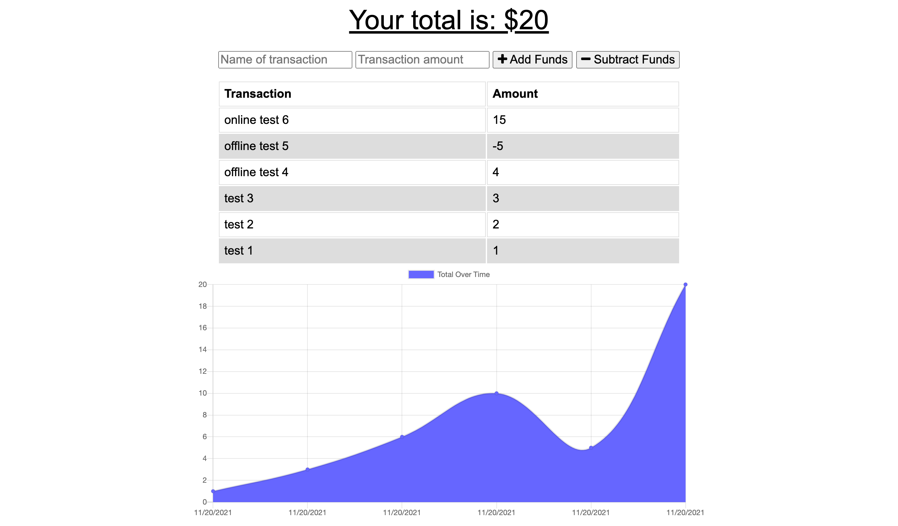
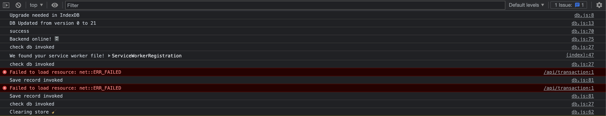

# Online/Offline Budget Trackers

## Description
In this app, we are using a service worker and indexedDB to allow offline access and funtionality. The user will be able to add expenses and deposits to this budgeting app with or without a connection. When entering transactions offline, they should populate the total when brought back online.

## Table of Contents
- [Installation](#installation)
- [Usage](#usage)
- [Deployment](#deployment)
- [Credits](#credits)
- [License](#license)
- [Tests](#tests)
- [Qustions](#questions)

## Installation
You must have node.js and mongoDB if running it locally. Type 'npm i' to install the dependencies needed.

## Usage
Type a transaction name and amount in the fields. Try going offline and online while using the application. You can check what is happening in console logs and what is being stored in indexedDB when toggling offline and online.

## Deployment
The application has been deployed on Heroku: https://on-offline-budget-tracker-rs.herokuapp.com/

## Credits
Collaborators that helped with this project: N/A

## License
This project is covered under an MIT license. More information can be found here: https://opensource.org/licenses/MIT

## Tests
N/A

## Questions
If you have any questions, feel free to email <mrronsit@gmail.com> or feel free to peruse my [Github](https://github.com/sitmeister)!
